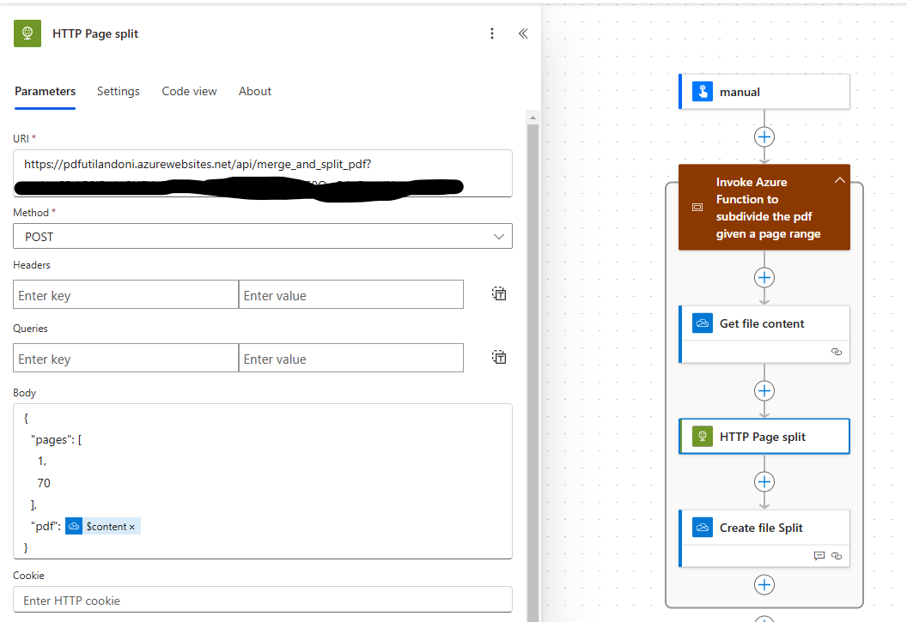
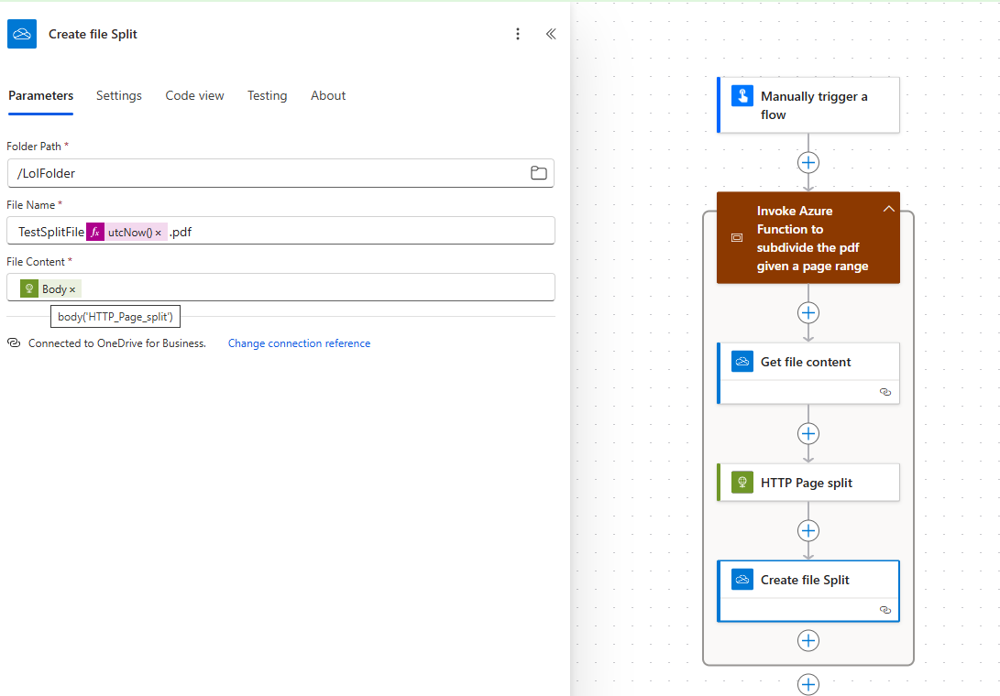

# Azure Function PDF Splitter

This Azure Function app is designed to split PDF files based on a given page range. It is intended to be invoked from Power Automate Cloud Flows using HTTP with function level authentication.

## Functionality

The function app expects a JSON payload with the following structure:

```json
{
    "pdf": "base64_encoded_pdf",
    "pages": [1, 3, 5]
}
```

- **pdf**: The base64 encoded PDF file.
- **pages**: An array of page numbers to be extracted from the PDF file.

The function app returns a JSON payload with the following structure:

```json
{
    "$content-type": "application/pdf",
    "$content": "base64_encoded_pdf"
}
```

- **$content-type**: Specifies the content type of the response.
- **$content**: Contains the base64 encoded PDF file with the extracted pages.

## Usage


### Power Automate Cloud Flow






## Notes

- Ensure the function app is authenticated with function level authentication.
- The function app should be deployed and configured to handle HTTP POST requests with the specified JSON payload structure.
- The response from the function app will be a JSON payload with the base64 encoded PDF file containing the extracted pages.
